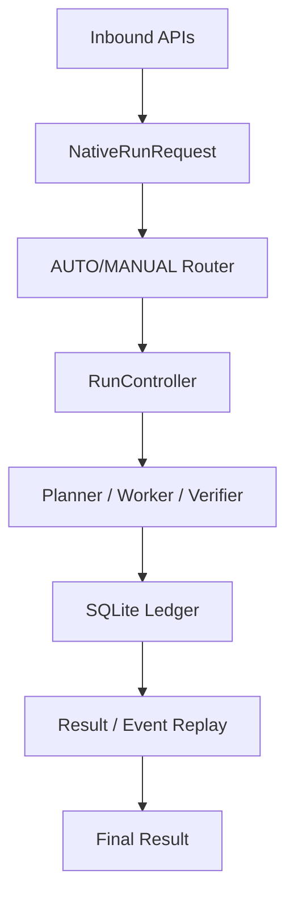

# PRP Runtime

The reference runtime for the Progressive Reasoning Protocol. Implementation milestones cover v0.0.1-v0.0.4, current package version is `0.0.1`.

[](https://www.python.org/)
[](https://github.com)
[](https://github.com)
[](https://github.com)

[简体中文](README.md) | English

## Facts

- **Package version**: `0.0.1`
- **Implementation milestones**: `v0.0.1` - `v0.0.4`
- Last verified: 1260 tests passed (2026-08-11)

PRP Runtime is the deterministic execution control layer above model calls. It unifies persistent workflows for Run, WorkUnit, Attempt, Artifact, Evidence, Event and provides AUTO/MANUAL routing strategies.

## Architecture & Execution Flow



### Four Execution Strategies

| Strategy | When to use | What it does |
|----------|-------------|-------------|
| DIRECT | Simple requests | Single WorkUnit, single Attempt; Worker returns Artifact then RuleVerifier |
| CASCADE | Requires layering | Executes profile chains with progressive verification |
| PLANNED | Requires graph scheduling | Compiles execution graph; Planner proposes plans, Worker executes |
| PROGRESSIVE | Requires evidence | Stepwise advancement; Verifier performs deterministic checks and budget control; failure triggers Planner revise |

### Run Flow

A request flows through: 4 inbound bindings (PRP Native, OpenAI Responses, OpenAI Chat Completions, Anthropic Messages) -> Router routes -> RunController decides strategy and starts execution -> Planner/Worker/Verifier executes and persists to SQLite Ledger -> Append-only event replay -> Final result.

## Configuration

All configuration comes from server-side environment variables with prefix `PRP_`; unrecognized variables are reported as errors instead of being ignored.

| Variable | Default | Description |
|----------|---------|-------------|
| `PRP_DATABASE_PATH` | `prp_runtime.db` | SQLite file path |
| `PRP_MAX_REQUEST_BYTES` | `1048576` | Request body size limit |
| `PRP_MAX_INPUT_CHARS` | `100000` | Maximum input text characters |
| `PRP_LOG_LEVEL` | `INFO` | Log level |
| `PRP_LEADER_PROFILE` | none | Strong model profile (JSON, `role` must be `PLANNER`) |
| `PRP_WORKER_PROFILE` | none | Execution model profile (JSON, `role` must be `WORKER`) |
| `PRP_CASCADE_PROFILES` | none | CASCADE strategy profile array |

Model profile example (`base_url` and `api_key` **must** come from server configuration, requests must not carry them):

```json
{
  "alias": "worker",
  "provider": "openai_compatible",
  "model": "your-model-id",
  "role": "WORKER",
  "base_url": "https://models.example.invalid/v1",
  "api_key": "...",
  "context_window_tokens": 32000,
  "max_output_tokens": 4000
}
```

## Quick Start

### Prerequisites
- Python 3.12+ or uv toolchain
- Clone the repo and install dependencies (see `pyproject.toml`)

### Minimal ASGI Example
Create `server.py`:

```python
from prp_runtime.settings import Settings
from prp_runtime.app import create_app

settings = Settings.from_env()
app = create_app(settings)

if __name__ == "__main__":
    import uvicorn
    uvicorn.run(app, host="0.0.0.0", port=8000)
```

Run:

```bash
uv run uvicorn server:app --reload
```

**Note**: `python -m prp_runtime` is an identity command that only prints package version; it is **not** a server launcher. Use the ASGI example above.

**Configuration safety boundary**: All LLM profiles (`base_url`, `api_key`, etc.) are provided exclusively via environment variables `PRP_*`; never include real secrets in code or examples.

### API Overview
- `POST /v1/runs`: PRP Native Run creation and management
- `POST /v1/responses`: OpenAI Responses compatible
- `POST /v1/chat/completions`: OpenAI Chat Completions
- `POST /v1/messages`: Anthropic Messages compatible

### Testing & Verification
Example:

```bash
uv run pytest -q
```

Full gate:

```bash
uv run pytest -q
uv run ruff check .
uv run mypy src/prp_runtime
```

Tests only cover implemented paths; real network calls are blocked. Benchmark is local relative evidence, not an SLA.

### Project Boundaries
- Not a model training, fine-tuning or GPU serving platform
- No MCP, A2A, Shell, browser or file writing Agents
- No multi-tenancy billing, SSO, distributed queues or Kubernetes orchestration
- No production SLA or stability guarantees

## License
Adopted `MIT OR Apache-2.0` dual license, either one. See [LICENSE-MIT](LICENSE-MIT), [LICENSE-APACHE](LICENSE-APACHE) and [NOTICE](NOTICE).
