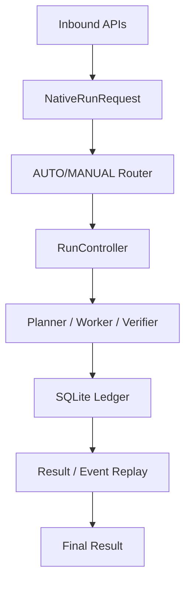

# PRP Runtime

Progressive Reasoning Protocol 的参考运行时。实现里程碑覆盖 v0.0.1-v0.0.4，包版本当前为 `0.0.1`。

[](https://www.python.org/)
[](https://github.com)
[](https://github.com)
[](https://github.com)

[简体中文](README.md) | [English](README.en.md)

## 事实定位

- **Package version**: `0.0.1`
- **Implementation milestones**: `v0.0.1` - `v0.0.4`
- 最近门禁验证：1260 tests passed (2026-08-11)

PRP Runtime 是确定性执行控制层，统一管理模型调用之上的 Run、WorkUnit、Attempt、Artifact、Evidence、Event 等持久化工作流，提供 AUTO/MANUAL 路由策略。

## 架构与运行链路



### 四策略说明

| 策略 | 何时使用 | 做什么 |
|------|----------|--------|
| DIRECT | 简单请求 | 单 WorkUnit、单 Attempt；Worker 返回 Artifact 后执行 RuleVerifier |
| CASCADE | 需要分层 | 按 profile 链条执行，逐层验证 |
| PLANNED | 需要图调度 | 编译执行图，Planner 提出计划，Worker 执行 |
| PROGRESSIVE | 需要证据 | 逐步推进，Verifier 做确定性校验和预算控制；失败后调用 Planner revise |

### 运行链路

一次请求流经：4 个入站绑定（PRP Native、OpenAI Responses、OpenAI Chat Completions、Anthropic Messages） -> Router 路由 -> RunController 决定策略和启动 -> Planner/Worker/Verifier 执行持久化到 SQLite Ledger -> 追加事件回放 -> 最终结果。

## 配置

- **PRP Native API**
  - `POST /v1/runs`：接受 `NativeRunRequest`（文本输入），创建并执行一个 Run，返回终态与结果。
  - `GET /v1/runs/{run_id}`：读取 Run 状态、结果文本、用量与错误。
  - `POST /v1/runs/{run_id}/cancel`：请求取消；取消后不再创建新 Attempt；对终态 Run 无副作用。
  - `GET /v1/runs/{run_id}/events`：以 SSE 从持久账本**回放**事件，支持 `Last-Event-ID` 与 `?after=` 游标续读。
  - `GET /health`：仅报告进程存活，不检查数据库或上游。
- **执行策略**：支持 `DIRECT`、`CASCADE`、`PLANNED`、`PROGRESSIVE` 以及 AUTO 路由。`AUTO` 路由根据请求动态选择策略并记录理由。
- **持久化**：单一 SQLite schema（`runs`/`work_units`/`attempts`/`artifacts`/`evidence`/`events` 等 8 张表），外键与 WAL 开启；Run 内事件 `sequence` 单调唯一；状态变更与事件同事务提交。
- **重启恢复**：进程启动时把仍处于 `RUNNING` 的 Attempt 标记为 `INTERRUPTED`（不假定成功或失败），Run 与 WorkUnit 状态保持可诊断。
- **出站 Provider**：一个 OpenAI-compatible 文本适配器（Chat Completions 形状），归一化 usage、finish reason 与错误分类；上游未报告 token 时记为不可用而不猜测。
- **错误契约**：稳定 `code` + `family` + `retryable`，响应体不含堆栈、内部路径或凭据。

全部配置来自服务端环境变量，前缀 `PRP_`；未识别的 `PRP_` 变量会直接报错而不是被忽略。

| 变量 | 默认值 | 说明 |
| --- | --- | --- |
| `PRP_DATABASE_PATH` | `prp_runtime.db` | SQLite 文件路径 |
| `PRP_MAX_REQUEST_BYTES` | `1048576` | 请求体上限 |
| `PRP_MAX_INPUT_CHARS` | `100000` | 输入文本字符上限 |
| `PRP_LOG_LEVEL` | `INFO` | 日志级别 |
| `PRP_LEADER_PROFILE` | 无 | 强模型 profile（JSON，`role` 必须为 `PLANNER`） |
| `PRP_WORKER_PROFILE` | 无 | 执行模型 profile（JSON，`role` 必须为 `WORKER`） |
| `PRP_CASCADE_PROFILES` | 无 | CASCADE 策略使用的 profile 数组 |

模型 profile 示例（`base_url` 与 `api_key` **只能**来自服务端配置，请求不得携带）：

```json
{
  "alias": "worker",
  "provider": "openai_compatible",
  "model": "your-model-id",
  "role": "WORKER",
  "base_url": "https://models.example.invalid/v1",
  "api_key": "...",
  "context_window_tokens": 32000,
  "max_output_tokens": 4000
}
```

## 目标

- 提供一个确定性控制器，统一执行 DIRECT、CASCADE、PLANNED、PROGRESSIVE 四种执行策略，并提供 AUTO 路由。
- 提供 PRP Native、OpenAI Responses、OpenAI Chat Completions、Anthropic Messages 四种入站绑定，映射到同一套原生领域模型。
- 由强模型提出计划，由确定性组件校验和提交；由较便宜的模型执行局部单元。
- 持久化 Run 与追加式事件账本，支持查询、取消和恢复。

## 非目标

- 不训练、微调或部署基础模型，不实现 GPU serving。
- 不实现 MCP、A2A、Shell、浏览器或文件写入 Agent。
- 不实现多租户计费、SSO、分布式队列或 Kubernetes 编排。
- 不支持图像、音频、视频和二进制附件。
- 不完整复刻第三方 API 的全部字段；未声明支持的字段返回结构化错误。
- 不保留 pre-0.1 数据迁移、旧 Schema 或兼容分支。

## 版本阶段

| 版本 | 范围 |
| --- | --- |
| `0.0.1` | 项目基础、领域合同、持久化、DIRECT 与 Native API |
| `0.0.2` | 验证器、预算与 CASCADE |
| `0.0.3` | 计划编译、可执行前沿与 PLANNED 并行 |
| `0.0.4` | PROGRESSIVE、AUTO 路由、外部绑定、基准与规范冻结 |

各阶段的“完成”指目标特性完成，不代表生产 SLA 或稳定性承诺。

## 快速开始

### 前置条件
- Python 3.12+ 或 uv 工具链
- 克隆仓库并依赖安装（详见 `pyproject.toml`）

### 最小 ASGI 示例
创建 `server.py`：

```python
from prp_runtime.settings import Settings
from prp_runtime.app import create_app

settings = Settings.from_env()
app = create_app(settings)

if __name__ == "__main__":
    import uvicorn
    uvicorn.run(app, host="0.0.0.0", port=8000)
```

运行：

```bash
uv run uvicorn server:app --reload
```

**配置安全边界**：所有 LLM profile（`base_url`、`api_key` 等）仅来自环境变量 `PRP_*`；示例使用 `models.example.invalid`。

### API 概览
- `POST /v1/runs`：PRP Native Run 创建与管理
- `POST /v1/responses`：OpenAI Responses 兼容
- `POST /v1/chat/completions`：OpenAI Chat Completions
- `POST /v1/messages`：Anthropic Messages 兼容

### 测试与验证
定向示例（测试已实现路径）：

```bash
uv run pytest tests/unit/control/test_direct.py -q
```

全量门禁：

```bash
uv run pytest -q
uv run ruff check .
uv run mypy src/prp_runtime
```

测试仅覆盖已实现路径，禁止真实网络调用。

### 项目边界
- 非模型训练、微调或 GPU serving 平台
- 无 MCP、A2A、Shell、浏览器或文件写入 Agent
- 无多租户计费、SSO、分布式队列或 Kubernetes 编排
- 无生产 SLA 或稳定性承诺

## 许可证

采用 `MIT OR Apache-2.0` 双许可，任选其一。详见 [LICENSE-MIT](LICENSE-MIT)、[LICENSE-APACHE](LICENSE-APACHE) 和 [NOTICE](NOTICE)。
